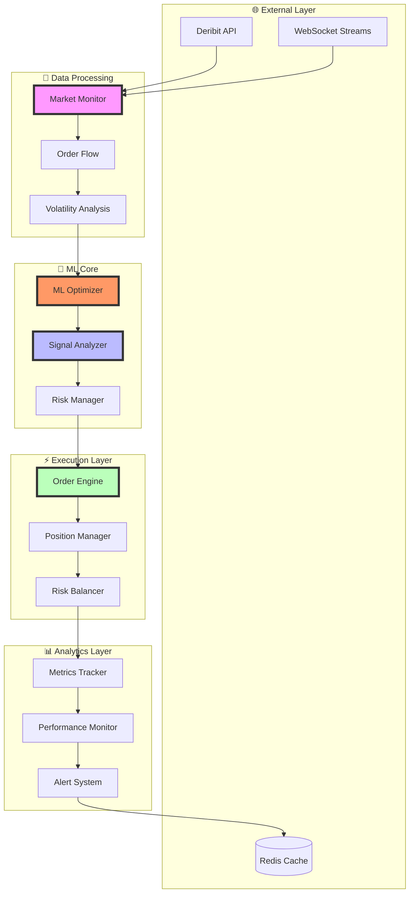

# 🚀 Gamma Straddle Bot

<div align="center">


</div>

<p align="center">
  <b>专业级加密货币期权交易系统</b><br>
  <sub>基于机器学习的动态gamma套利策略 🌟</sub>
</p>

<p align="center">
  <a href="#✨-核心特性">特性</a> •
  <a href="#🏗️-系统架构">架构</a> •
  <a href="#🤖-ML引擎">ML引擎</a> •
  <a href="#📦-快速开始">开始</a> •
  <a href="#📊-性能监控">监控</a> •
  <a href="#🛡️-风险管理">风险</a>
</p>

---

## ✨ 核心特性

### 🎯 智能交易引擎
- **ML驱动决策**: 基于LightGBM的自适应参数优化
- **实时市场分析**: 毫秒级行情处理，纳秒级决策
- **多维度策略**: 结合期权Greeks、波动率曲面和市场微结构
- **智能执行**: 自适应订单路由，优化执行成本

### 🤖 ML优化系统
- **动态参数预测**: 实时预测最优交易参数
- **自适应学习**: 持续从市场反馈中学习和优化
- **多模型集成**: 组合多个专业模型优化不同方面
- **健康监控**: 实时监控模型性能和预测质量

### 🔄 高性能架构
- **异步处理**: 基于Python asyncio的高性能异步架构
- **内存优化**: 高效的数据结构和缓存机制
- **分布式支持**: 可水平扩展的模块化设计
- **故障恢复**: 自动化的错误检测和恢复机制

## 🏗️ 系统架构



## 🤖 ML引擎

### 预测模型
- **仓位规模预测**: 0.02-0.15
- **止盈目标预测**: 0.1-0.5
- **止损水平预测**: 0.05-0.2

### 特征工程
- Basis百分位数
- 流动性评分
- 波动率百分位数
- Gamma百分位数
- 资金费率
- 价格VWAP偏差
- 买卖价差
- 24小时成交量
- 24小时价格变化
- 订单簿不平衡度
- VWAP偏差
- 动量得分
- 市场冲击
- 实现波动率

### 模型架构
- **框架**: LightGBM
- **优化器**: Optuna
- **验证**: 5折交叉验证
- **评估指标**: MAE, R²

## 📦 快速开始

### 环境要求
- Python 3.10-3.12
- Ubuntu 22.04 LTS
- Redis 6.0+

### 环境准备

```bash
# 创建虚拟环境
python -m venv venv

# 激活环境
source venv/bin/activate

# 安装依赖
pip install -r requirements.txt
```

### 配置系统

```bash
# 复制配置模板
cp .env.example .env

# 编辑配置文件
vim .env
```

### ML配置参数

```python
# ML参数
MODEL_UPDATE_INTERVAL = 3600  # 模型更新间隔(秒)
MIN_TRAIN_SAMPLES = 1000     # 最小训练样本数
FEATURE_IMPORTANCE_THRESHOLD = 0.01  # 特征重要性阈值

# 预测限制
MAX_POSITION_SCALE = 2.0     # 最大仓位放大倍数
MIN_POSITION_SCALE = 0.5     # 最小仓位缩小倍数
PREDICTION_TIMEOUT = 100     # 预测超时(ms)
```

## 📊 性能监控

### ML性能指标
- **预测准确率**: R² > 0.6
- **特征重要性**: 动态跟踪
- **模型健康度**: 实时监控
- **预测延迟**: < 50ms

### 系统指标
- **延迟监控**: WebSocket延迟、订单延迟
- **性能指标**: CPU使用率、内存占用
- **交易指标**: 成交率、滑点统计
- **风险指标**: Greeks暴露、VaR计算

## 🛡️ 风险管理

### ML风险控制
- **预测验证**: 范围和合理性检查
- **动态调整**: 基于模型置信度
- **降级机制**: 模型性能不佳时启用保守参数
- **实时监控**: 持续评估预测质量

### 系统风险控制
- **策略风险**: Greeks中性、波动率敞口
- **执行风险**: 智能订单拆分、滑点控制
- **系统风险**: 故障恢复、资金安全
- **模型风险**: 预测偏差、过拟合监控

## 📈 性能基准

### ML性能
- 预测准确率: R² > 0.6
- 特征重要性稳定性: > 90%
- 模型更新时间: < 60s
- 单次预测延迟: < 50ms

### 系统性能
- API延迟: < 50ms
- 订单延迟: < 100ms
- CPU使用率: < 50%
- 内存使用: < 2GB

## 🔧 高级配置

### ML优化配置
```python
# 模型参数
NUM_BOOST_ROUND = 1000    # 提升轮数
LEARNING_RATE = 0.01      # 学习率
MAX_DEPTH = 6            # 最大树深度
MIN_CHILD_WEIGHT = 1     # 最小叶子权重

# 训练控制
TRAIN_FREQ = 3600        # 训练频率(秒)
VAL_SIZE = 0.2          # 验证集比例
EARLY_STOPPING = 50      # 早停轮数
```

### 监控配置
```python
# ML监控
MODEL_HEALTH_WINDOW = 100    # 模型健康检查窗口
FEATURE_DRIFT_THRESHOLD = 0.1 # 特征漂移阈值

# 系统监控
METRICS_WINDOW = 3600        # 指标统计窗口(秒)
ALERT_COOLDOWN = 300         # 告警冷却时间(秒)
```

## 📝 更新日志

### v2.0.0
- 引入ML驱动的参数优化系统
- 实现动态仓位和止盈止损预测
- 添加模型健康监控机制
- 优化特征工程流程

### v1.0.0
- 初始版本发布
- 实现基础交易功能
- 建立风险控制体系
- 完成性能监控系统
